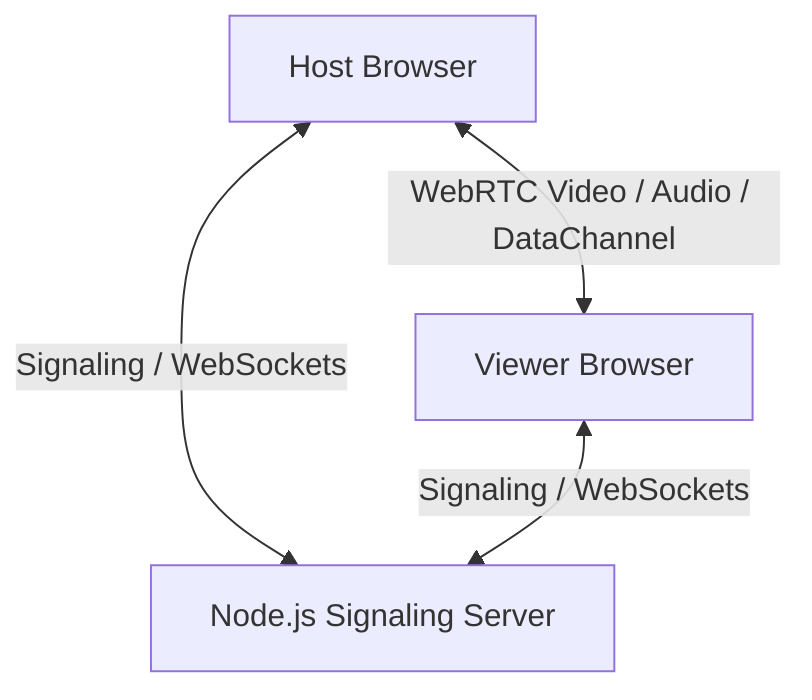

# 🎬 WatchTogether

[](https://watch-together-qk70.onrender.com/)

**WatchTogether** is a premium, private watch party application designed for high-fidelity, shared media experiences. It prioritizes a **"Cinematic Excellence"** aesthetic—characterized by deep velvet reds, dark charcoal surfaces, and elegant serif typography—to create a luxury viewing environment that feels like a private theater.

With **zero-account friction**, users can spin up a secure room in seconds, stream up to UHD (4K) content, chat directly over encrypted peer-to-peer channels, and enjoy movie nights with small groups of friends.

---

## ✨ Features

- **Zero-Account Barrier:** No signup or login required to create or join a room. Simply enter a display name, and you're ready.
- **Cinematic Red Aesthetic:** Tailored dark mode design utilizing deep charcoal (`#121411`), velvet red (`#9B1B1B`), subtle vignettes, glassmorphic backdrops, and editorial typography (Newsreader & Inter).
- **High-Fidelity Screen Sharing:** Support for host-controlled screen/video streaming, supporting custom resolution constraints from **480p up to UHD (4K)** at 30fps.
- **Real-Time Mic Audio:** Integrated mic stream support with real-time level monitoring (visual speaking indicators) and viewer volume/mute controls.
- **End-to-End Private Chat:** Low-latency chat sidebar using peer-to-peer WebRTC `RTCDataChannel`s. Messages bypass the server completely.
- **Discord-style Chat Threading:** Messages from the same user are visually grouped with continuous layouts, avatars, and custom badges (e.g., **Host** badge).
- **Session Resilience:** Persistent state management with cookies and LocalStorage allows hosts and viewers to reconnect seamlessly if they refresh or temporarily drop.
- **Room Capacity Limits:** Optimized for intimate groups of up to 6 concurrent viewers to preserve bandwidth and maintain performance.

---

## 🏗️ Architecture

WatchTogether uses a decoupled client-server architecture:



### 1. Signaling Server (`server/`)
A lightweight **Node.js + Express** app serving **Socket.io**.
- **Role:** Facilitates the initial handshake. Since WebRTC requires browsers to discover each other before establishing direct connections, the server passes the SDP Offers, Answers, and ICE Candidates.
- **Room State:** Tracks active room memberships in memory (`rooms` object) mapping room codes to lists of active socket IDs. No databases or authentication modules are required.
- **Cleanup:** Automatically prunes empty rooms, notifies members when someone leaves, and manages room limits.

### 2. Client Application (`client/`)
A high-performance **Single Page Application (SPA)** written in vanilla JS/CSS.
- **Routing:** Handled via hash-based URL navigation (`#landing`, `#create`, `#host`, `#viewer`, etc.) and CSS visibility toggles.
- **WebRTC Stack:** Automatically creates independent `RTCPeerConnection` instances for each peer in a 1-to-many topology (Host acts as the broadcaster).
- **Voice Metrics:** Analyzes input microphone gain using the Web Audio API (`AudioContext` + `AnalyserNode`) to light up the mic icon when speaking.

---

## 📁 Repository Structure

```
watch-together/
├── client/                 # Frontend client files (SPA)
│   ├── index.html          # Cinematic HTML structure, forms, and video layouts
│   ├── styles.css          # Vanilla CSS containing design system and typography tokens
│   └── app.js              # Routing, WebRTC handshake, sockets, and stream controllers
│
├── server/                 # Backend signaling server
│   ├── index.js            # Express server & Socket.io handshake controller
│   ├── package.json        # Dependencies (Express, Socket.io, CORS)
│   └── pnpm-lock.yaml      # Locked dependencies
│
├── design/                 # High-fidelity design specs & mockups
│   ├── DESIGN.md           # Design guidelines and style system
│   └── watchtogether_project_prd_updated.md  # Product Requirements Document
│
├── plan.md                 # Original step-by-step developer tutorial
└── README.md               # Main repository documentation
```

---

## 🚀 Getting Started

### Prerequisites
- [Node.js](https://nodejs.org/) (LTS recommended)
- [pnpm](https://pnpm.io/) or `npm` / `yarn`

### 1. Start the Signaling Server
Navigate to the `server/` directory, install dependencies, and start the development server:

```bash
cd server
pnpm install
pnpm run dev
```
The signaling server will start on port `3000` (e.g. `http://localhost:3000`). You can verify it's working by opening `http://localhost:3000/health` in your browser.

### 2. Run the Frontend Client
You can open `client/index.html` directly in your browser, or run a local static server inside the `client/` folder.

If using **VS Code**, the [Live Server](https://marketplace.visualstudio.com/items?itemName=ritwickdey.LiveServer) extension is highly recommended:
1. Open the project in VS Code.
2. Click the **"Go Live"** button at the bottom-right corner of VS Code to start a local static server (usually starts on port `5500` at `http://127.0.0.1:5500/client/index.html`).

---

## 🛠️ WebRTC Technical Specifications

- **STUN Server:** Google's public STUN server (`stun:stun.l.google.com:19302`) is integrated to resolve NAT/firewall traversal for cross-network connections.
- **Negotiation Locks:** Implements a queuing and locking mechanism (`negotiationLocks` & `negotiationPending` states) in `client/app.js` to prevent race conditions (such as the `m-lines` error) when adding screen-share and mic tracks simultaneously.
- **Group Chat Data Channel:** A reliable WebRTC `RTCDataChannel` named `"chat"` is established directly between connected peers. Text messages are encrypted in transit via standard DTLS-SRTP.
